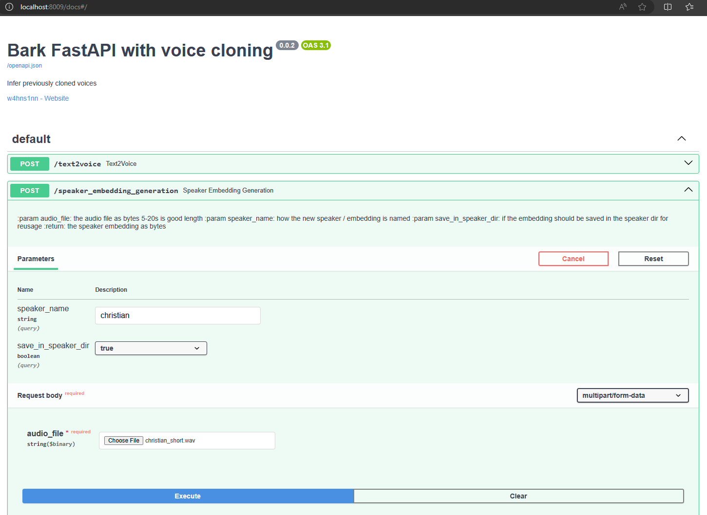

    
# Text2Speech & voice cloning by SocAIty

Ever wanted to create natural sounding speech from text or clone a voice? 
Perfect for creating voiceovers, audiobooks, or just having fun.

Features:
- text2speech synthesis with the 🐶 Bark model of [Suno.ai](https://github.com/suno-ai)
  - Generate text in different languages
  - Supports emotions & singing.
- speaker generation / embedding generation aka voice cloning 
- voice2voice synthesis: given an audio file, generate a new audio file with the voice of a different speaker
- Convenient deployment ready web API with [FastTaskAPI](https://github.com/SocAIty/FastTaskAPI)
- Automatic download of models

## Example generations and cloned voices

... Coming soon!

# Installation

With PIP
```bash
# from PyPi
pip install socaity-text2voice
# or from GitHub for the newest version.
pip install git+https://github.com/SocAIty/text2speech
```
Or clone and work with the repository.1. Clone the repository.
2. (Optional) Create a virtual environment. With `python -m venv venv` and activate it with `venv/Scripts/activate`.
3. Install the requirements.
`pip install -r requirements.txt`
4. Don't forget to install pytorch gpu version (with `pip3 install torch torchvision torchaudio --index-url https://download.pytorch.org/whl/cu118`)

The code runs fine on Windows and Linux. 

# Usage
We provide three ways to use the face swapping functionality.
1. [Direct module import and inference](#Inference-from-script) 
2. [By deploying and calling the web service](#Web-Service)
3. As part of the [socaity SDK](https://github.com/SocAIty/socaity).  # coming soon


## Inference from script

```python
import text2voice as t2v

# simple text2speech synthesis
audio_numpy, sample_rate = t2v.text2voice("I love socaity [laughs]", speaker_name="en_speaker_3")

# speaker embedding generation
embedding = voice2embedding(audio_file="voice_sample_15s.wav", speaker_name="hermine").save_to_speaker_lib()

# text2speech synthesis with cloned voice or embedding
audio_with_cloned_voice, sample_rate = text2voice(sample_text, voice=embedding)  # also works with voice="hermine"

# voice2voice synthesis
cloned_audio = voice2voice(audio_file="my_audio_file.wav", voice_name_or_embedding_path="hermine")

```
Use the following code to convert and save the audio file with the [media-toolkit](https://github.com/SocAIty/media-toolkit) module.
```python
from media_toolkit import AudioFile
audio = AudioFile().from_np_array(audio_numpy, sr=sample_rate)
audio.save("my_new_audio.wav")
```


## Web Service





1. Start the server by running the provided .bat file "start_server.bat" 
   2. or by using `python bark/server.py --port 8009` make sure the python PYTHONPATH is set to the root of this repository.
2. To test the server, open `http://localhost:8009/docs` in your browser.

Then make post requests to the server with your favorite tool or library.
Here are some examples to inference with a python client.

Note: The first time you start the server, it will download the models. This can take a while.
If this fails, you can download the files manually or with the model_downloader.py script.

### For text2speech synthesis

```python
import requests
response = requests.post("http://localhost:8009/text2voice", params={ "text" : "please contribute", "voice": "en_speaker_3"})
```
The response is a .wav file as bytes. You can save it with:

```python
import librosa
from io import BytesIO

# convert to audio file
audio_file, sr = librosa.load(BytesIO(response.content))
# save to file
sf.write(save_file_path, audio_file, sr)
```

### For speaker embedding generation

```python
import requests
with open("myfile.wav", "rb") as f:
    audio = f.read()
response = requests.post("http://localhost:8009/create_speaker_embedding", params={ "speaker_name" : "my_new_speaker"}, files={"audio_file": audio})
```
The response is a .npz file as bytes. 
After the embedding was created it can be used in text2speech synthesis.

### For voice2voice synthesis

```python
import requests
with open("myfile.wav", "rb") as f:
    audio = f.read()
response = requests.post("http://localhost:8009/voice2voice", params={ "speaker_name" : "my_new_speaker"}, files={"audio_file": audio})
```
In this example it is assumed that previously a speaker with name "my_new_speaker" was created with the create_speaker_embedding endpoint.


# Cloud environments

All settings relevant for execution are stored in settings.py and adjustable via environment variables.
When run in docker or a cloud environment, just set the environment variables accordingly.


# Comparison to other t2s libraries

- Coqui-TTS: Does NOT easily run on windows. Supports more different models.

# Disclaimer
This repository is a merge of the orignal [bark repository](https://github.com/suno-ai/bark) and [bark-voice-cloning-HuBert-quantizer](https://github.com/gitmylo/bark-voice-cloning-HuBERT-quantizer/blob/master/readme.md) by [gitmylo](https://github.com/gitmylo)
The credit goes to the original authors. Like the original authors, I am also not responsible for any misuse of this repository. Use at your own risk, and please act responsibly.

# Contribute

any help with maintaining and extending the package is welcome. Feel free to open an issue or a pull request.
ToDo: make inference faster by keeping models in memory
